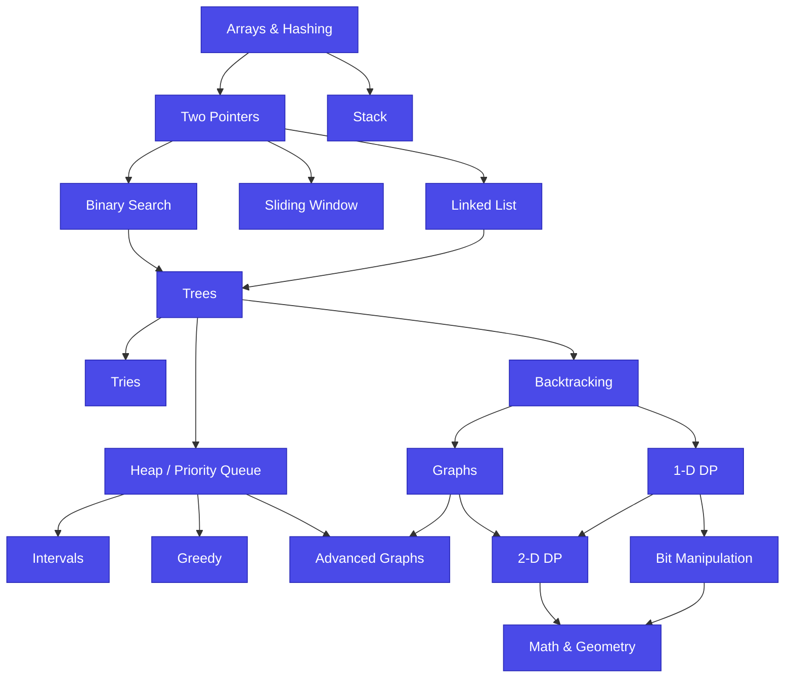

# NeetCode 150 — Roadmap & Problem Tracker

> A curated list of 150 LeetCode problems organized by the [NeetCode Roadmap](https://neetcode.io/roadmap), covering 18 algorithmic patterns. Total: **28 Easy · 97 Medium · 25 Hard = 150 problems**.

---

## Instructions for the Agent

You are setting up a Git repository to track and solve the NeetCode 150 problems.

**Tasks to perform:**

1. **Initialize the repo** with this `README.md` at the root.
2. **Create the folder structure** described in [Repository Structure](#repository-structure) below — one folder per category, slugified using `kebab-case` and prefixed with a 2-digit order number (e.g. `01-arrays-and-hashing`).
3. **Inside each category folder**, create a `README.md` listing that category's problems with checkboxes and links (you can copy the relevant section from below).
4. **For each problem**, create a solution file using the slug naming convention (e.g. `two-sum.py`) with the [solution template](#solution-file-template) at the top.
5. **Use the language** the user specifies — default to **Python** if unspecified. If the user wants multiple languages, create a sub-folder per language inside each problem (e.g. `two-sum/python/solution.py`, `two-sum/typescript/solution.ts`).
6. **Add a `.gitignore`** appropriate to the chosen language.
7. **Commit** with the message: `chore: scaffold NeetCode 150 roadmap structure`.

Do **not** solve the problems automatically — leave them as stubs for the user to work through. The checklist in this README is the source of truth for tracking progress; mark `[x]` when a problem is solved.

---

## The Roadmap

Categories form a dependency DAG. Start at **Arrays & Hashing** and follow the arrows — each topic builds on its prerequisites.



**Recommended order** (linearization of the DAG, with branches you can interleave):

1. Arrays & Hashing → Two Pointers → Stack
2. Sliding Window → Binary Search → Linked List
3. Trees → Tries → Heap / Priority Queue → Backtracking
4. Intervals → Greedy → Graphs → Advanced Graphs
5. 1-D DP → 2-D DP → Bit Manipulation → Math & Geometry

---

## Repository Structure

```
.
├── README.md                          ← this file
├── .gitignore
├── 01-arrays-and-hashing/
│   ├── README.md
│   ├── contains-duplicate.py
│   ├── valid-anagram.py
│   └── ...
├── 02-two-pointers/
├── 03-stack/
├── 04-binary-search/
├── 05-sliding-window/
├── 06-linked-list/
├── 07-trees/
├── 08-tries/
├── 09-heap-priority-queue/
├── 10-backtracking/
├── 11-graphs/
├── 12-advanced-graphs/
├── 13-1d-dp/
├── 14-2d-dp/
├── 15-greedy/
├── 16-intervals/
├── 17-math-and-geometry/
└── 18-bit-manipulation/
```

---

## Solution File Template

Each solution file should start with this header (adjust syntax for the chosen language):

```python
"""
Problem: <Problem Name>
Difficulty: <Easy | Medium | Hard>
Category: <Category Name>
LeetCode: https://leetcode.com/problems/<slug>/

Approach:
- TODO: describe the approach

Time Complexity: O(?)
Space Complexity: O(?)
"""


class Solution:
    def solve(self, *args):
        # TODO: implement
        pass
```

---

## Progress

- **Overall:** 0 / 150
- **Easy:** 0 / 28
- **Medium:** 0 / 97
- **Hard:** 0 / 25

---

## Problems by Category

### 01. Arrays & Hashing (0 / 9)

- [ ] [Contains Duplicate](https://leetcode.com/problems/contains-duplicate/) — `Easy`
- [ ] [Valid Anagram](https://leetcode.com/problems/valid-anagram/) — `Easy`
- [ ] [Two Sum](https://leetcode.com/problems/two-sum/) — `Easy`
- [ ] [Group Anagrams](https://leetcode.com/problems/group-anagrams/) — `Medium`
- [ ] [Top K Frequent Elements](https://leetcode.com/problems/top-k-frequent-elements/) — `Medium`
- [ ] [Encode and Decode Strings](https://leetcode.com/problems/encode-and-decode-strings/) — `Medium`
- [ ] [Product of Array Except Self](https://leetcode.com/problems/product-of-array-except-self/) — `Medium`
- [ ] [Valid Sudoku](https://leetcode.com/problems/valid-sudoku/) — `Medium`
- [ ] [Longest Consecutive Sequence](https://leetcode.com/problems/longest-consecutive-sequence/) — `Medium`

### 02. Two Pointers (0 / 5)

- [ ] [Valid Palindrome](https://leetcode.com/problems/valid-palindrome/) — `Easy`
- [ ] [Two Sum II - Input Array Is Sorted](https://leetcode.com/problems/two-sum-ii-input-array-is-sorted/) — `Medium`
- [ ] [3Sum](https://leetcode.com/problems/3sum/) — `Medium`
- [ ] [Container With Most Water](https://leetcode.com/problems/container-with-most-water/) — `Medium`
- [ ] [Trapping Rain Water](https://leetcode.com/problems/trapping-rain-water/) — `Hard`

### 03. Stack (0 / 7)

- [ ] [Valid Parentheses](https://leetcode.com/problems/valid-parentheses/) — `Easy`
- [ ] [Min Stack](https://leetcode.com/problems/min-stack/) — `Medium`
- [ ] [Evaluate Reverse Polish Notation](https://leetcode.com/problems/evaluate-reverse-polish-notation/) — `Medium`
- [ ] [Generate Parentheses](https://leetcode.com/problems/generate-parentheses/) — `Medium`
- [ ] [Daily Temperatures](https://leetcode.com/problems/daily-temperatures/) — `Medium`
- [ ] [Car Fleet](https://leetcode.com/problems/car-fleet/) — `Medium`
- [ ] [Largest Rectangle in Histogram](https://leetcode.com/problems/largest-rectangle-in-histogram/) — `Hard`

### 04. Binary Search (0 / 7)

- [ ] [Binary Search](https://leetcode.com/problems/binary-search/) — `Easy`
- [ ] [Search a 2D Matrix](https://leetcode.com/problems/search-a-2d-matrix/) — `Medium`
- [ ] [Koko Eating Bananas](https://leetcode.com/problems/koko-eating-bananas/) — `Medium`
- [ ] [Find Minimum in Rotated Sorted Array](https://leetcode.com/problems/find-minimum-in-rotated-sorted-array/) — `Medium`
- [ ] [Search in Rotated Sorted Array](https://leetcode.com/problems/search-in-rotated-sorted-array/) — `Medium`
- [ ] [Time Based Key-Value Store](https://leetcode.com/problems/time-based-key-value-store/) — `Medium`
- [ ] [Median of Two Sorted Arrays](https://leetcode.com/problems/median-of-two-sorted-arrays/) — `Hard`

### 05. Sliding Window (0 / 6)

- [ ] [Best Time to Buy and Sell Stock](https://leetcode.com/problems/best-time-to-buy-and-sell-stock/) — `Easy`
- [ ] [Longest Substring Without Repeating Characters](https://leetcode.com/problems/longest-substring-without-repeating-characters/) — `Medium`
- [ ] [Longest Repeating Character Replacement](https://leetcode.com/problems/longest-repeating-character-replacement/) — `Medium`
- [ ] [Permutation in String](https://leetcode.com/problems/permutation-in-string/) — `Medium`
- [ ] [Minimum Window Substring](https://leetcode.com/problems/minimum-window-substring/) — `Hard`
- [ ] [Sliding Window Maximum](https://leetcode.com/problems/sliding-window-maximum/) — `Hard`

### 06. Linked List (0 / 11)

- [ ] [Reverse Linked List](https://leetcode.com/problems/reverse-linked-list/) — `Easy`
- [ ] [Merge Two Sorted Lists](https://leetcode.com/problems/merge-two-sorted-lists/) — `Easy`
- [ ] [Linked List Cycle](https://leetcode.com/problems/linked-list-cycle/) — `Easy`
- [ ] [Reorder List](https://leetcode.com/problems/reorder-list/) — `Medium`
- [ ] [Remove Nth Node From End of List](https://leetcode.com/problems/remove-nth-node-from-end-of-list/) — `Medium`
- [ ] [Copy List with Random Pointer](https://leetcode.com/problems/copy-list-with-random-pointer/) — `Medium`
- [ ] [Add Two Numbers](https://leetcode.com/problems/add-two-numbers/) — `Medium`
- [ ] [Find the Duplicate Number](https://leetcode.com/problems/find-the-duplicate-number/) — `Medium`
- [ ] [LRU Cache](https://leetcode.com/problems/lru-cache/) — `Medium`
- [ ] [Merge k Sorted Lists](https://leetcode.com/problems/merge-k-sorted-lists/) — `Hard`
- [ ] [Reverse Nodes in k-Group](https://leetcode.com/problems/reverse-nodes-in-k-group/) — `Hard`

### 07. Trees (0 / 15)

- [ ] [Invert Binary Tree](https://leetcode.com/problems/invert-binary-tree/) — `Easy`
- [ ] [Maximum Depth of Binary Tree](https://leetcode.com/problems/maximum-depth-of-binary-tree/) — `Easy`
- [ ] [Diameter of Binary Tree](https://leetcode.com/problems/diameter-of-binary-tree/) — `Easy`
- [ ] [Balanced Binary Tree](https://leetcode.com/problems/balanced-binary-tree/) — `Easy`
- [ ] [Same Tree](https://leetcode.com/problems/same-tree/) — `Easy`
- [ ] [Subtree of Another Tree](https://leetcode.com/problems/subtree-of-another-tree/) — `Easy`
- [ ] [Lowest Common Ancestor of a Binary Search Tree](https://leetcode.com/problems/lowest-common-ancestor-of-a-binary-search-tree/) — `Medium`
- [ ] [Binary Tree Level Order Traversal](https://leetcode.com/problems/binary-tree-level-order-traversal/) — `Medium`
- [ ] [Binary Tree Right Side View](https://leetcode.com/problems/binary-tree-right-side-view/) — `Medium`
- [ ] [Count Good Nodes in Binary Tree](https://leetcode.com/problems/count-good-nodes-in-binary-tree/) — `Medium`
- [ ] [Validate Binary Search Tree](https://leetcode.com/problems/validate-binary-search-tree/) — `Medium`
- [ ] [Kth Smallest Element in a BST](https://leetcode.com/problems/kth-smallest-element-in-a-bst/) — `Medium`
- [ ] [Construct Binary Tree from Preorder and Inorder Traversal](https://leetcode.com/problems/construct-binary-tree-from-preorder-and-inorder-traversal/) — `Medium`
- [ ] [Binary Tree Maximum Path Sum](https://leetcode.com/problems/binary-tree-maximum-path-sum/) — `Hard`
- [ ] [Serialize and Deserialize Binary Tree](https://leetcode.com/problems/serialize-and-deserialize-binary-tree/) — `Hard`

### 08. Tries (0 / 3)

- [ ] [Implement Trie (Prefix Tree)](https://leetcode.com/problems/implement-trie-prefix-tree/) — `Medium`
- [ ] [Design Add and Search Words Data Structure](https://leetcode.com/problems/design-add-and-search-words-data-structure/) — `Medium`
- [ ] [Word Search II](https://leetcode.com/problems/word-search-ii/) — `Hard`

### 09. Heap / Priority Queue (0 / 7)

- [ ] [Kth Largest Element in a Stream](https://leetcode.com/problems/kth-largest-element-in-a-stream/) — `Easy`
- [ ] [Last Stone Weight](https://leetcode.com/problems/last-stone-weight/) — `Easy`
- [ ] [K Closest Points to Origin](https://leetcode.com/problems/k-closest-points-to-origin/) — `Medium`
- [ ] [Kth Largest Element in an Array](https://leetcode.com/problems/kth-largest-element-in-an-array/) — `Medium`
- [ ] [Task Scheduler](https://leetcode.com/problems/task-scheduler/) — `Medium`
- [ ] [Design Twitter](https://leetcode.com/problems/design-twitter/) — `Medium`
- [ ] [Find Median from Data Stream](https://leetcode.com/problems/find-median-from-data-stream/) — `Hard`

### 10. Backtracking (0 / 9)

- [ ] [Subsets](https://leetcode.com/problems/subsets/) — `Medium`
- [ ] [Combination Sum](https://leetcode.com/problems/combination-sum/) — `Medium`
- [ ] [Permutations](https://leetcode.com/problems/permutations/) — `Medium`
- [ ] [Subsets II](https://leetcode.com/problems/subsets-ii/) — `Medium`
- [ ] [Combination Sum II](https://leetcode.com/problems/combination-sum-ii/) — `Medium`
- [ ] [Word Search](https://leetcode.com/problems/word-search/) — `Medium`
- [ ] [Palindrome Partitioning](https://leetcode.com/problems/palindrome-partitioning/) — `Medium`
- [ ] [Letter Combinations of a Phone Number](https://leetcode.com/problems/letter-combinations-of-a-phone-number/) — `Medium`
- [ ] [N-Queens](https://leetcode.com/problems/n-queens/) — `Hard`

### 11. Graphs (0 / 13)

- [ ] [Number of Islands](https://leetcode.com/problems/number-of-islands/) — `Medium`
- [ ] [Max Area of Island](https://leetcode.com/problems/max-area-of-island/) — `Medium`
- [ ] [Clone Graph](https://leetcode.com/problems/clone-graph/) — `Medium`
- [ ] [Walls and Gates](https://leetcode.com/problems/walls-and-gates/) — `Medium`
- [ ] [Rotting Oranges](https://leetcode.com/problems/rotting-oranges/) — `Medium`
- [ ] [Pacific Atlantic Water Flow](https://leetcode.com/problems/pacific-atlantic-water-flow/) — `Medium`
- [ ] [Surrounded Regions](https://leetcode.com/problems/surrounded-regions/) — `Medium`
- [ ] [Course Schedule](https://leetcode.com/problems/course-schedule/) — `Medium`
- [ ] [Course Schedule II](https://leetcode.com/problems/course-schedule-ii/) — `Medium`
- [ ] [Graph Valid Tree](https://leetcode.com/problems/graph-valid-tree/) — `Medium`
- [ ] [Number of Connected Components in an Undirected Graph](https://leetcode.com/problems/number-of-connected-components-in-an-undirected-graph/) — `Medium`
- [ ] [Redundant Connection](https://leetcode.com/problems/redundant-connection/) — `Medium`
- [ ] [Word Ladder](https://leetcode.com/problems/word-ladder/) — `Hard`

### 12. Advanced Graphs (0 / 6)

- [ ] [Min Cost to Connect All Points](https://leetcode.com/problems/min-cost-to-connect-all-points/) — `Medium`
- [ ] [Network Delay Time](https://leetcode.com/problems/network-delay-time/) — `Medium`
- [ ] [Cheapest Flights Within K Stops](https://leetcode.com/problems/cheapest-flights-within-k-stops/) — `Medium`
- [ ] [Reconstruct Itinerary](https://leetcode.com/problems/reconstruct-itinerary/) — `Hard`
- [ ] [Swim in Rising Water](https://leetcode.com/problems/swim-in-rising-water/) — `Hard`
- [ ] [Alien Dictionary](https://leetcode.com/problems/alien-dictionary/) — `Hard`

### 13. 1-D DP (0 / 12)

- [ ] [Climbing Stairs](https://leetcode.com/problems/climbing-stairs/) — `Easy`
- [ ] [Min Cost Climbing Stairs](https://leetcode.com/problems/min-cost-climbing-stairs/) — `Easy`
- [ ] [House Robber](https://leetcode.com/problems/house-robber/) — `Medium`
- [ ] [House Robber II](https://leetcode.com/problems/house-robber-ii/) — `Medium`
- [ ] [Longest Palindromic Substring](https://leetcode.com/problems/longest-palindromic-substring/) — `Medium`
- [ ] [Palindromic Substrings](https://leetcode.com/problems/palindromic-substrings/) — `Medium`
- [ ] [Decode Ways](https://leetcode.com/problems/decode-ways/) — `Medium`
- [ ] [Coin Change](https://leetcode.com/problems/coin-change/) — `Medium`
- [ ] [Maximum Product Subarray](https://leetcode.com/problems/maximum-product-subarray/) — `Medium`
- [ ] [Word Break](https://leetcode.com/problems/word-break/) — `Medium`
- [ ] [Longest Increasing Subsequence](https://leetcode.com/problems/longest-increasing-subsequence/) — `Medium`
- [ ] [Partition Equal Subset Sum](https://leetcode.com/problems/partition-equal-subset-sum/) — `Medium`

### 14. 2-D DP (0 / 11)

- [ ] [Unique Paths](https://leetcode.com/problems/unique-paths/) — `Medium`
- [ ] [Longest Common Subsequence](https://leetcode.com/problems/longest-common-subsequence/) — `Medium`
- [ ] [Best Time to Buy and Sell Stock with Cooldown](https://leetcode.com/problems/best-time-to-buy-and-sell-stock-with-cooldown/) — `Medium`
- [ ] [Coin Change II](https://leetcode.com/problems/coin-change-ii/) — `Medium`
- [ ] [Target Sum](https://leetcode.com/problems/target-sum/) — `Medium`
- [ ] [Interleaving String](https://leetcode.com/problems/interleaving-string/) — `Medium`
- [ ] [Edit Distance](https://leetcode.com/problems/edit-distance/) — `Medium`
- [ ] [Longest Increasing Path in a Matrix](https://leetcode.com/problems/longest-increasing-path-in-a-matrix/) — `Hard`
- [ ] [Distinct Subsequences](https://leetcode.com/problems/distinct-subsequences/) — `Hard`
- [ ] [Burst Balloons](https://leetcode.com/problems/burst-balloons/) — `Hard`
- [ ] [Regular Expression Matching](https://leetcode.com/problems/regular-expression-matching/) — `Hard`

### 15. Greedy (0 / 8)

- [ ] [Maximum Subarray](https://leetcode.com/problems/maximum-subarray/) — `Medium`
- [ ] [Jump Game](https://leetcode.com/problems/jump-game/) — `Medium`
- [ ] [Jump Game II](https://leetcode.com/problems/jump-game-ii/) — `Medium`
- [ ] [Gas Station](https://leetcode.com/problems/gas-station/) — `Medium`
- [ ] [Hand of Straights](https://leetcode.com/problems/hand-of-straights/) — `Medium`
- [ ] [Merge Triplets to Form Target Triplet](https://leetcode.com/problems/merge-triplets-to-form-target-triplet/) — `Medium`
- [ ] [Partition Labels](https://leetcode.com/problems/partition-labels/) — `Medium`
- [ ] [Valid Parenthesis String](https://leetcode.com/problems/valid-parenthesis-string/) — `Medium`

### 16. Intervals (0 / 6)

- [ ] [Meeting Rooms](https://leetcode.com/problems/meeting-rooms/) — `Easy`
- [ ] [Insert Interval](https://leetcode.com/problems/insert-interval/) — `Medium`
- [ ] [Merge Intervals](https://leetcode.com/problems/merge-intervals/) — `Medium`
- [ ] [Non-overlapping Intervals](https://leetcode.com/problems/non-overlapping-intervals/) — `Medium`
- [ ] [Meeting Rooms II](https://leetcode.com/problems/meeting-rooms-ii/) — `Medium`
- [ ] [Minimum Interval to Include Each Query](https://leetcode.com/problems/minimum-interval-to-include-each-query/) — `Hard`

### 17. Math & Geometry (0 / 8)

- [ ] [Happy Number](https://leetcode.com/problems/happy-number/) — `Easy`
- [ ] [Plus One](https://leetcode.com/problems/plus-one/) — `Easy`
- [ ] [Rotate Image](https://leetcode.com/problems/rotate-image/) — `Medium`
- [ ] [Spiral Matrix](https://leetcode.com/problems/spiral-matrix/) — `Medium`
- [ ] [Set Matrix Zeroes](https://leetcode.com/problems/set-matrix-zeroes/) — `Medium`
- [ ] [Pow(x, n)](https://leetcode.com/problems/powx-n/) — `Medium`
- [ ] [Multiply Strings](https://leetcode.com/problems/multiply-strings/) — `Medium`
- [ ] [Detect Squares](https://leetcode.com/problems/detect-squares/) — `Medium`

### 18. Bit Manipulation (0 / 7)

- [ ] [Single Number](https://leetcode.com/problems/single-number/) — `Easy`
- [ ] [Number of 1 Bits](https://leetcode.com/problems/number-of-1-bits/) — `Easy`
- [ ] [Counting Bits](https://leetcode.com/problems/counting-bits/) — `Easy`
- [ ] [Reverse Bits](https://leetcode.com/problems/reverse-bits/) — `Easy`
- [ ] [Missing Number](https://leetcode.com/problems/missing-number/) — `Easy`
- [ ] [Sum of Two Integers](https://leetcode.com/problems/sum-of-two-integers/) — `Medium`
- [ ] [Reverse Integer](https://leetcode.com/problems/reverse-integer/) — `Medium`

---

## Tips for the Grind

- **Follow the roadmap order.** Each category builds on the previous one — don't skip ahead.
- **Don't skip Easy problems.** They establish the core pattern of each category.
- **Solve on paper first**, then code. Talking through the solution out loud often reveals the right approach.
- **Brute force first, optimize later.** Get something working before chasing the optimal solution.
- **Re-do problems** you struggled with after a few days to lock in the pattern.
- **Track time**: aim for ~30 minutes per Medium. If stuck longer, check the [NeetCode video solution](https://neetcode.io/practice).

---

## References

- [neetcode.io](https://neetcode.io/practice/practice/neetcode150) — official list with video solutions
- [neetcode.io/roadmap](https://neetcode.io/roadmap) — interactive roadmap
- [LeetCode](https://leetcode.com/) — where problems live
